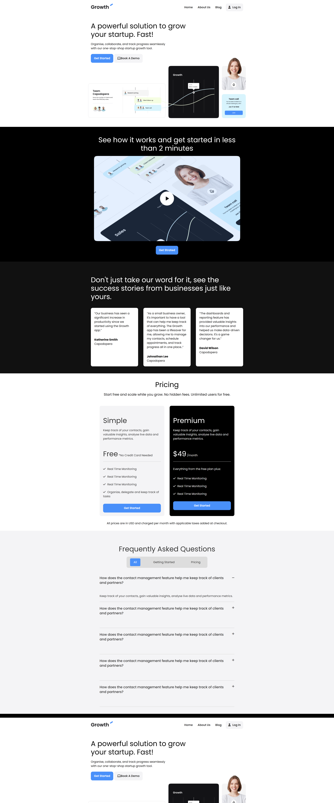

# Nahid App - Startup Growth Solution

A professional, responsive landing page designed for a startup growth tool, featuring a clean UI, organized sections, and modern typography. This project showcases a powerful solution for startups to organize, collaborate, and track progress seamlessly.

---

## 🚀 Features

* **Responsive Navigation**: Features a sticky-ready navbar with links for Home, About Us, and Blog, including a mobile-friendly hamburger menu.
* **Hero Section**: An impactful header with high-contrast typography and call-to-action buttons for getting started or booking a demo.
* **Video Integration**: A dedicated "How it Works" section featuring a video preview to engage users in under two minutes.
* **Success Stories**: A testimonial grid showcasing success stories from various businesses to build credibility.
* **Pricing Plans**: A structured pricing section with comparative cards for "Simple" (Free) and "Premium" plans.
* **Interactive FAQ**: A functional Frequently Asked Questions section with categorized menus and expandable/collapsible content.
* **Newsletter Subscription**: Integrated newsletter sign-up form within the footer to drive user engagement.
* **Detailed Footer**: A multi-column footer layout including company links, resources, social media icons, and contact information.

## 🛠️ Technology Stack

* **HTML5**: Semantic markup for a structured and accessible web experience.
* **CSS3**: Custom styling managed through external stylesheets for a modern look and feel.
* **Google Fonts**: Utilizes the "Poppins" font family for clean and professional typography.
* **Font Awesome**: Integrated for high-quality iconography throughout the application.
* **JavaScript**: Custom logic handled via `main.js` for interactive elements like the mobile menu and FAQ.

## 📁 Project Structure

* **index.html**: The main entry point containing all site sections and structures.
* **CSS/**: Contains `style.css` for site-wide aesthetics and responsive layouts.
* **JS/**: Contains `main.js` for handling frontend interactivity.
* **pictures/**: Directory for all visual assets including logos, favicons, and section previews.

---

## 👤 Author

* 👤 **Name**: MH Nahid

## 🌐 Social Media

* 📧 **Contact**: [Send an Email](mailto:mokbulhasannahid@gmail.com)